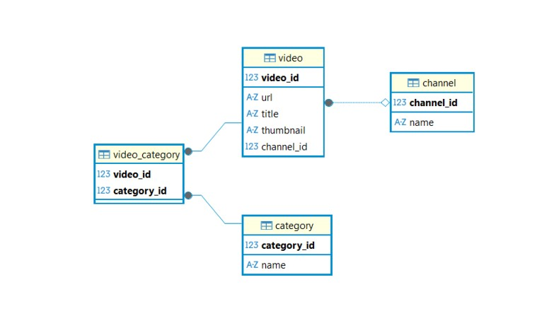
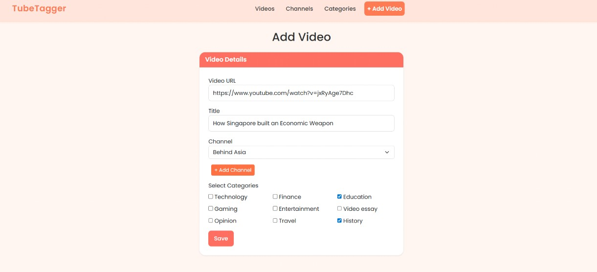
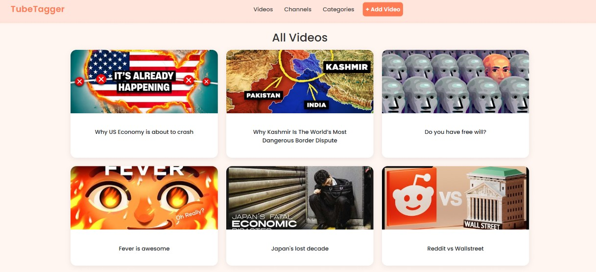
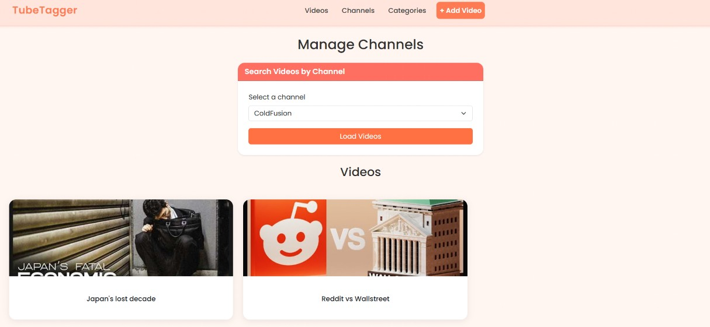
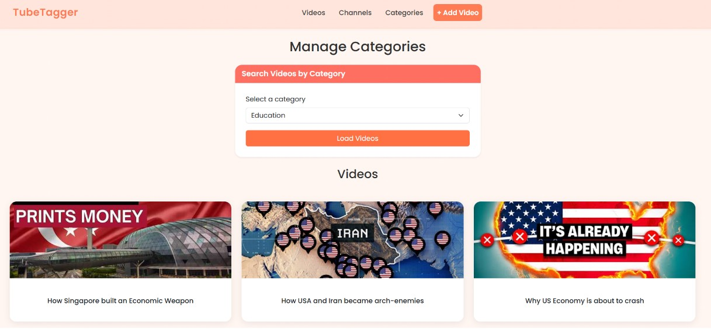

# 🎥 TubeTagger - Personal Video Library Manager

A clean, structured Spring Boot application to manage YouTube videos, channels, and categories with a focus on simplicity, performance, and real-world usability.

---

## 🚀 Features

* Add youtube videos using YouTube URL
* Auto-generate thumbnails
* Assign videos to a channel
* Tag videos with multiple categories
* Create new channels directly via modal
* Browse All Videos page with pagination
* Automatically sort by latest added videos
* View videos by Channel and Category
* Robust URL Validation

---

## 🛠 Tech Stack

* **Frontend**: Thymeleaf, Bootstrap
* **Backend**: Java, Spring Boot
* **Database**: PostgreSQL
* **ORM**: Spring Data JPA / Hibernate

---

## 🗄 Database Schema



* Video → Many-to-One → Channel
* Video → Many-to-Many → Categories

---

## 🗄 Architecture Overview

* Browser -> Thymeleaf View -> Spring MVC Controller -> Service Layer -> JPA Repository -> PostgreSQL Database
* Each layer has a single responsibility and communicates only with the layer directly below it.
  
---

## ⚙️ Setup Instructions

### 1. Clone the repository

```bash
git clone https://github.com/dheerajmnk/tubetagger
```

### 2. Start PostgreSQL using Docker

```bash
docker run --name tubetagger -d -p 5432:5432 -e POSTGRES_PASSWORD=db_pass -e POSTGRES_DB=tubetagger postgres
```

### 3. Configure database connection by updating application.properties

```properties
spring.datasource.url=jdbc:postgresql://localhost:5432/tubetagger
spring.datasource.username=postgres
spring.datasource.password=db_pass
```

### 4. Build the project

```bash
mvn clean install
```

### 5. Run the application

```bash
./mvnw spring-boot:run
```

### 6. Open the app

```
http://localhost:8080
```
---

## 📸 Screenshots

* Add video page
  
  

* All videos page
  
  

* Channels page
  
  

* Categories page
  
    
